# Javascript数据结构与算法

## 什么是数据结构和算法
- 数据结构：计算机中存储和组织数据的方式
- 常见的数据结构：
    * 数组 array
    * 栈 stack
    * 堆 heap
    * 链表 linked list
    * 队列 queue
    * 散列表 hash
    * 树 tree
    * 图 graph
- 算法：解决问题的逻辑和步骤


## 数组Array
+ 数组的优点在于按下表查找和修改元素非常神速，一步到位
+ 缺点在于数组的扩容、元素的添加、元素的删除，尤其是位置靠前的元素，因为有大量元素的位移，消耗性能
+ 相比较而言，链表的优点是元素的添加删除和扩容，缺点是查找，因为是线性查找按照存储的顺序挨个儿找，所以慢
+ 数组通常是申请的连续的内存空间，当做插入操作的时候发现数组容量不够了，数据就需要扩容，一般是申请一个更大的数组，比如2倍，然后把原数组的内容拷贝过去
+ js中的数组数据结构已经封装的很完整了，就是API的调用即可
+ 常用方法：
    * push
    * pop
    * forEach
    * map
    * reduce
    * filter
    * join
    * concat
    * includes
    * shift
    * unshift
    * some
    * every
    * splice
    * Array.isArray


## 栈Stack
+ 认识栈： 栈的印象就是一个上面开口下面闭口的水杯子，相对比于数组的任意位置添加删除元素，栈和队列虽然和数组一样同为线性数据结构，但会受一些限制，受限的数据结构在解决一类问题时候会有特别的效果。
+ 特点：
    * 先进后出（FILO）
    * 栈顶：开口的一端
    * 栈底：闭口的一端
    * 栈结构添加、删除数据叫做进栈、出栈
    * 数据的添加和删除都只能在**栈顶**位置进行
    * 类比于餐馆叠起来的托盘、函数调用栈：函数A调用B ，B调用C，C调用D，那么从栈底到栈顶就分别是A，B，C，调用完成后的弹出顺序是C，B，A
    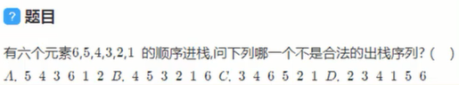
+ 栈的实现
    - 实现方式：
        * 基于数组
        * 基于链表  
    - 栈的属性：定义一个数组属性    
    - 栈的常见操作
        * push(ele):添加元素到栈顶
        * pop():删除栈顶元素，并返回该元素
        * peek():仅返回栈顶元素
        * size():返回栈内元素个数
        * isEmpty():空栈返回false,有元素返回true
        * toString():以字符串形式返回栈的元素 
+ 栈结构的使用
    - 十进制转二进制，反复对2取余之后将结果倒排，先进后出     
    - 中缀表达式转后缀表达式
    - 栈的遍历可以使用while语句和isEmpty方法的结合`while (!s.isEmpty()) {}`           
+ 栈的封装源码
```javascript
//栈类的定义
class Stack{
    //栈的属性
    constructor(){
        this.items = [];
    }
    //栈的操作
    // push(ele):添加元素到栈顶
    push(ele){
        this.items.push(ele);
        return this; //形成链式调用
    }
    // pop():删除栈顶元素，并返回该元素
    pop(){
        if(!this.isEmpty()){
            return this.items.pop();
        }
    }
    // peek():仅返回栈顶元素
    peek(){
        if(!this.isEmpty()){
            return this.items[this.size() - 1];
        }
    }
    // size():返回栈内元素个数
    size(){
        return this.items.length;
    }
    // isEmpty():空栈返回false,有元素返回true
    isEmpty(){
        return this.size() == 0 ? true : false;
    }
    // toString():以字符串形式返回栈的元素
    toString(){
        return this.items.join(' ');
    }    
}

module.exports = Stack;
```


## 队列Queue/PriorityQueue
+ 认识队列：队列也是一种受限的线性数据结构，图像类似于电影检票入口的排队，检票处就是队伍的前端，队列的最后就是后端
+ 特点：
    - 存在队列的前端、后端的概念，成为队首队尾
    - 只允许在队列的前端做删除操作，在队列的后端做添加操作
    - 先进先出 FIFO
    - 线程队列就是先进入队列的线程先出来分配资源
+ 队列的实现
    - 实现方式：数组、链表
    - 队列的常见操作
        * enqueue(ele):添加元素到队尾
        * dequeue():删除队列前端的第一个元素，并返回该元素
        * front():仅返回队列前端的第一个元素
        * size():返回队列内元素个数
        * isEmpty():空栈返回false,有元素返回true
        * toString():以字符串形式返回队列的元素
+ 优先级队列
    - 特点
        * 队列中的每个元素有两个成分：1.元素的值 2.元素的优先级
        * 优先级队列的入队操作不是直接插入到队尾，而是要根据优先级来确定位置
    - 应用场景
        * 急诊科队列，医生根据病人严重紧急程度来决定队伍顺序
    - 优先级队列的实现：
        * 定义优先级数字小的优先级高
        * 优先级元素是一个对象，由元素值和优先级数字两个属性组成，实现方式可考虑再定义一个元素类
        * 入队：优先级队列的插入和普通队列不同，新入队的元素，要和现有队列的元素逐一比较优先级，如果优先级高于某个元素则排在那个元素的前面，如果比所有元素优先级都低就排在队尾。
        * toString:因为优先级队列内部元素是一个对象，需要做处理
        * 其余操作都和普通队列类似,所以可以继承普通队列类。
+ 队列封装源码
```javascript
//队列类的定义
class Queue{
    //队列属性
    constructor(){
        this.items = [];
    }
    //队列操作
    //enqueue(ele):添加元素到队尾
    enqueue(ele){
        this.items.push(ele);
        return this;
    }
    //dequeue():删除队列前端的第一个元素，并返回该元素
    dequeue(){
        if(!this.isEmpty()){
            return this.items.shift();
        }
    }
    //front():仅返回队列前端的第一个元素
    front(){
        if(!this.isEmpty()){
            return this.items[0];
        }
    }
    //size():返回队列内元素个数
    size(){
        return this.items.length;
    }
    //isEmpty():空栈返回false,有元素返回true
    isEmpty(){
        return this.size() == 0;
    }
    //toString():以字符串形式返回队列的元素
    toString(){
        return this.items.join(' ');
    }   
}

module.exports = Queue;

//优先级队列类的定义
let Queue = require('./01_队列的封装');
class PriorityQueue extends Queue{
    //优先级队列属性
    constructor(){
        super();
    }
    //优先级队列操作
    //enqueue(val , priority):添加元素到优先级正确位置
    enqueue(val , priority){
        let ele = new QueueEle(val , priority);
        if(this.isEmpty()){
            this.items.push(ele);
            return this;
        }else{
            /* 新入队的元素，要和现有队列的元素逐一比较优先级，
            如果优先级高于某个元素则排在那个元素的前面，
            如果比所有元素优先级都低就排在队尾 */
            for(let i = 0 ; i < this.size() ; i++){
                if(priority < this.items[i].priority){
                    this.items.splice(i , 0 , ele);
                    return this;
                }
            }
            this.items.push(ele);
            return this;
        }
    }
    //toString():以字符串形式返回队列的元素
    toString(){
        let tmp = this.items.map((ele , i) => {
            return ele.val + '-' + ele.priority;
        });
        return tmp.join(' ');
    }   
}

//定义一个内部类:队列的元素，包含元素的值和优先级。定义的方式是一个构造函数（原先ES5定义类的方式）
class QueueEle{
    constructor(val , priority){
        this.val = val;
        this.priority = priority;
    }
}
module.exports = PriorityQueue;
```    

## 链表LinkedList/DoublyLinkedList
+ 认识链表：类似于火车的结构，火车头就是head头指针，每一节火车车厢就是一个节点，车厢里装的人就是数据，车厢连接到下一个车厢的铁链就是指针，最后一节车厢的铁链不连接车厢，类比于链表的尾部节点的指针指向null
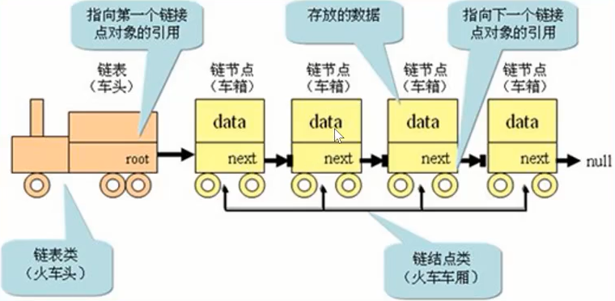
+ 特点
    - 链表有节点组成，每一个节点都由数据和指向下一个节点的指针构成
    - 内存空间是不必连续的，冲分利用内存，实现内存动态管理
    - 链表不必在创建的时候确定大小，可以无限扩容下去
    - 链表在插入、删除元素的时候时间复杂度是O(1)
    - 链表在查询数据的时候就很被动，必须从第一个节点往后逐个查询，绕不开所以慢，然而数组可以根据下标直接一口气查询到复杂度O(1)
+ 单向链表的实现
    - 属性：head头指针 length链表长度
    - Node节点类的定义 
    - 常见操作方法：
        * append(data):向链表尾部添加元素
        * insert(pos , data):向指定位置插入元素
        * removeAt(pos):删除指定位置的元素,返回被删除元素的数据
        * remove(data):删除指定元素,返回被删除元素的下标
        * update(pos , data):修改指定位置的元素
        * get(pos):查询指定位置的元素
        * indexOf(data):查询元素的位置，没有则返回-1
        * size():返回链表内元素个数
        * isEmpty():空栈返回false,有元素返回true
        * toString():以字符串形式返回链表的元素
    - 认为第一个节点的下标pos是0，第二个节点下标是1，以此类推，最后一个节点的下标是length-1
    - 插入操作的一个原则就是，原来位置上的节点的位置一定要先赋值给别人或者保留一份备份
    - `this.head`表示的永远是第一个节点的内存位置
    - 遍历链表的常规操作
        ```javascript
        let curnode = this.head;
        while(条件){
            ...
            curnode = curnode.next;
        }
        ```
    - 只要参数里面有pos参数就要考虑下标越界的问题    
+ 单向链表的特点和缺点
    - 只能从头遍历到尾，或者从尾遍历到头
    - 链表连接的方向是单向的
    - 访问下一个节点很简单，但是想访问上一个节点就很麻烦
+ 双向链表的特点和缺点
    - 既可以从头遍历到尾，也可以从尾遍历到头
    - 链表连接的方向是双向的
    - 一个节点既有向前的指针也有向后的指针
    - 每次添加、删除的时候需要考虑4个指针
    - 相对于单向链表，占用空间大一些
    - 双向链表使用起来很方便，开发时使用的比单向链表多
    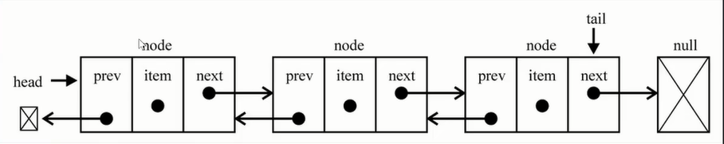
    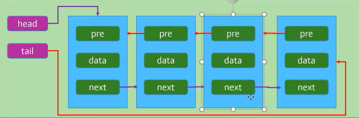
+ 双向链表的实现
    - 常见操作方法：
        * append(data):向链表尾部添加元素
        * insert(pos , data):向指定位置插入元素
        * removeAt(pos):删除指定位置的元素,返回被删除元素的数据
        * remove(data):删除指定元素,返回被删除元素的下标
        * update(pos , data):修改指定位置的元素
        * get(pos):查询指定位置的元素
        * indexOf(data):查询元素的位置，没有则返回-1
        * size():返回链表内元素个数
        * isEmpty():空栈返回false,有元素返回true
        * toString():以字符串形式返回链表的元素
        * forwardString():正向遍历，以字符串形式返回链表的元素
        * backwardString():反向遍历，以字符串形式返回链表的元素
    - 找到最后一个节点的方式（确定链表不为空时）
        ```javascript
        let curnode = this.head;
        while (curnode.next) {
            curnode = curnode.next;
        }
        ```
    - 找到下标值为pos的节点位置
        ```javascript
        let curnode = this.head;
        let previous = null;
        let i = 0;
        while(i < pos){//这个条件的临界值是结合0 1 2实际画图推算出来的
            previous = curnode;
            curnode = curnode.next;
            i++;
        } 
        ```  
    - 判断pos下标是更靠前，还是更靠后,如果pos < length / 2 , 选择从头结点开始遍历，否则从尾开始遍历 
+ 链表的封装
```javascript
//单向链表类的定义
class LinkedList{
    //属性
    constructor(){
        this.head = null; //链表的头指针，指向第一个节点，表示第一个节点的位置
        this.length = 0; //链表的长度
    }
    //操作
    // append(data):向链表尾部添加元素
    append(data){
        //1.创建新节点
        let node = new Node(data);
        //2.如果链表里没有节点，就将头指针指向新节点，作为新节点的位置
        if(this.length == 0){
            this.head = node;
        }
        //3.如果链表里已经有节点了,就找到最后一个节点，将next指向新节点
        else{
            let curnode = this.head; //当前节点的位置，用来遍历链表
            while(curnode.next){
                curnode = curnode.next;
            }
            curnode.next = node;
        }
        //4.链表的长度加一
        this.length += 1;
        return this;
    }
    // insert(pos , data):向指定位置插入元素
    insert(pos , data){
        //1.判断pos想要插入的下标是否合法，认为下标在0~length是合法的,创建节点
        if(pos < 0 || pos > this.length){
            return false;
        }
        let node = new Node(data);
        /*2.如果pos下标是0，表示在第一个节点的位置插入新节点，
        需要将原来的第一个节点的位置作为新节点的next，头指针指向新节点 */
        if(pos == 0){
            node.next = this.head;
            this.head = node;
        }
        /*3.如果pos下标不是0，表示在两个节点中间插入新节点,
        需要找到下标为pos的节点位置作为新节点的next，
        下标为pos节点的前一个节点的位置的next指向新节点 */
        else{
            //遍历链表找到pos下标的节点和他的前一个节点
            let curnode = this.head;
            let previous = null;
            let i = 0;
            while(i < pos){//这个条件的临界值是结合0 1 2实际画图推算出来的
                previous = curnode;
                curnode = curnode.next;
                i++;
            }
            node.next = curnode;
            previous.next = node;
        }
        /*4.如果pos下标为length，表示在链表的尾部追加元素，
        事实证明情况3的实现涵盖情况4所以不用单独处理了,
        按照链表目前只有下标为0 1 2的三个节点来算，pos等于3,
        while循环里面最后一次执行时i为2就是说执行了3次，
        此时curnode表示的是下标为2的next,即null,previous即下标为2的节点，
        接下来的操作正好满足要求 */
        //5.链表的长度加一
        this.length += 1;
        return this;
    }
    // remove(data):删除指定元素,返回被删除元素的下标
    remove(data){
        //1. 根据数据找到节点下标，
        let pos = this.indexOf(data);
        //2. 再根据下标删除节点
        this.removeAt(pos);
        //3.长度减一
        this.length -= 1;
        //4. 返回下标
        return pos;
    }
    // removeAt(pos):删除指定位置的元素,返回被删除元素的数据
    removeAt(pos){
        //1. 判断pos下标越界,如果越界就返回空对象
        if(pos < 0 || pos > this.length - 1){
            return null;
        }
        //2. 遍历链表，如果pos是0则将head头指针指向第一个节点的下一个节点（做个空节点判断）
        //如果pos不是0则先找到下标为pos的节点和他的前一个节点，将pos节点的next赋值给前一个节点的next
        let curnode = this.head;
        if(pos == 0){
            if(curnode){
                let data = curnode.data;
                this.head = curnode.next;
                this.length -= 1;
                return data;
            }else{
                return null;
            }
        }else{
            let previous = null;
            let i = 0;
            while (i < pos) {
                previous = curnode;
                curnode = curnode.next;
                i++;
            }
            previous.next = curnode.next;
            this.length -= 1;
            return curnode.data;
        }
    }
    // update(pos,data):修改指定位置的元素
    update(pos, data){
        //1. 判断pos下标越界,如果越界就返回空对象
        if(pos < 0 || pos > this.length - 1){
            return false;
        }
        //2.遍历链表，找到下标为pos的节点位置，找到了则修改节点的数据
        let curnode = this.head;
        let i = 0;
        while(i < pos){
            curnode = curnode.next;
            i++;
        }
        curnode.data = data;
    }
    // get(pos):查询指定位置的元素,返回该元素
    get(pos){
        //1. 判断pos下标越界,如果越界就返回空对象
        if(pos < 0 || pos > this.length - 1){
            return null;
        }
        //2.遍历链表，找到下标为pos的节点位置，找到了则立刻返回节点的数据
        let curnode = this.head;
        let i = 0;
        while(i < pos){
            curnode = curnode.next;
            i++;
        }
        return curnode.data;
    }
    // indexOf(data):查询元素的位置，没有则返回-1
    indexOf(data){
        /* 1. 遍历链表，定义下标变量i,检查每个节点的数据是否等于data，
        如果相等则返回节点下标i,如果不等则当前节点后移，i加一 */
        let curnode = this.head;
        let i = 0;
        while(curnode){
            if(curnode.data == data){
                return i;
            }else{
                curnode = curnode.next;
                i++;
            }
        }
        //2. 遍历了全表都没找到数据相同的节点，就返回-1
        return -1;
    }
    // size():返回链表内元素个数
    size(){
        return this.length;
    }
    // isEmpty():空栈返回false,有元素返回true
    isEmpty(){
        return this.length == 0;
    }
    // toString():以字符串形式返回链表的元素
    toString(){
        //1.遍历整个链表，经过每个节点的时候把data读出来，拼接成字符串
        let curnode = this.head;
        let result = '';
        while(curnode){
            result += curnode.data + ' ';
            curnode = curnode.next;
        }
        return result;
    }
}


//节点类
class Node{
    constructor(data){
        this.data = data;
        this.next = null;
    }
}

module.exports = LinkedList;


//双向列表类的定义
let LinkedList = require('./01_单向链表的封装');
class DoublyLinkedList extends LinkedList{
    //属性
    constructor(){
        super(); //head  length
        this.tail = null;//尾指针
    }
    //操作
    // append(data):向链表尾部添加元素
    append(data){
        //1.创建新节点
        let node = new Node(data);
        //2.判断链表里面有没有节点，如果没有，则添加为第一个节点，将头指针指向新节点，尾指针也指向新节点即可
        if(this.length == 0){
            this.head = node;
            this.tail = node;
        }
        /* 3.如果链表里有节点，由于尾结点的位置就是this.tail，
        将尾结点的位置赋值为新节点的pre，将新节点的位置赋值给尾结点的next,
        将新节点赋值给this.tail */
        else{
            node.pre = this.tail;
            this.tail.next = node;
            this.tail = node;
        }
        //4.长度加一
        this.length += 1;
        return this;
    }
    // insert(pos , data):向指定位置插入元素
    insert(pos , data){
        //1.下标越界判断
        if(pos < 0 || pos > this.length){
            return false;
        }
        //2.创建新的节点
        let node = new Node(data);
        //3.判断链表是否为空
        //3.1链表为空，则插入新节点是第一个节点，需要将头指针尾指针都只想新节点
        if(this.length == 0){
            this.head = node;
            this.tail = node;
        }
        //3.2链表不为空，则需要判断插入的位置，判断pos下标
        else{
            /*3.2.1如果是插入到第一个节点的位置，需要将头结点的位置赋值给新节点的next,
            把新节点的位置赋值给头结点的pre,重新给头指针赋值*/
            if(pos == 0){
                node.next = this.head;
                this.head.pre = node;
                this.head = node;
            }
            //3.2.2如果是追加到链表的尾部
            else if(pos == this.length){
                node.pre = this.tail;
                this.tail.next = node;
                this.tail = node;
            }
            /*3.2.3如果是插入到两个节点之间，则需要找到下标为pos的节点位置，
            然后处理4个指针，优先处理已经存在值的指针，
            首先将pos节点的pre赋值给新节点的pre,
            再将pos节点位置赋值给新节点的next,
            再将新节点的位置赋值给pos节点的pre的next
            最后将新节点的位置赋值给pos节点的pre*/
            else{
                let curnode = this.head;
                let i = 0;
                while (i < pos) {
                    curnode = curnode.next;
                    i++;
                }
                node.pre = curnode.pre;
                node.next = curnode;
                curnode.pre.next = node;
                curnode.pre = node;
            }
        }

        //链表长度加一
        this.length += 1;
    }
    // removeAt(pos):删除指定位置的元素,返回被删除元素的数据
    removeAt(pos){
        //1. 判断pos下标越界,如果越界就返回空对象,声明返回数据
        if(pos < 0 || pos > this.length - 1){
            return null;
        }
        let result = null;
        //2. 判断pos下标的值
        //2.1如果下标是0，删除第一个节点，将第一个节点的next赋值给头指针,将第二个节点的pre置空
        if(pos == 0){
            result = this.head.data;
            //2.1.1如果整个链表只有一个节点
            if(this.length == 0){
                this.head = null;
                this.tail =null;
            }
            //2.1.2如果整个链表有多个节点
            else{
                this.head = this.head.next;
                this.head.pre = null;
            }
        }
        //2.2如果下标是length-1,删除最后一个节点,将最后一个节点的pre赋值给为指针,把新的尾结点的next置空
        else if(pos == this.length - 1){
            result = this.tail.data;
            this.tail = this.tail.pre;
            this.tail.next = null;
        }
        //2.3删除两个节点中间的节点
        else{
            //2.3.1找到下标为pos的节点位置，根据pos < length /2 来选择遍历的方向
            let curnode = null;
            if(pos < this.length / 2){
                curnode = this.head;
                let i = 0;
                while (i < pos) {
                    curnode = curnode.next;
                    i++;
                }
            }else{
                curnode = this.tail;
                let i = this.length - 1;
                while (i > pos) {
                    curnode = curnode.pre;
                    i--;
                }
            }
            /* 2.3.2保存被删除节点的数据，
            将pos节点的next赋值给pos节点的pre的next，
            将pos节点的pre赋值给pos节点的next的pre */
            result = curnode.data;
            curnode.pre.next = curnode.next;
            curnode.next.pre = curnode.pre;
        }
        //3. 长度减一
        this.length -= 1;

        //4.返回被删除的数据
        return result;
    }
    // remove(data):删除指定元素,返回被删除元素的下标,继承单向链表
    // update(pos , data):修改指定位置的元素
    update(pos, data){
        //1. 判断pos下标越界,如果越界就返回空对象
        if(pos < 0 || pos > this.length - 1){
            return false;
        }
        //2.判断pos下标是更靠前，还是更靠后
        //2.1如果pos < length / 2 , 选择从头结点开始遍历，找到了下标为pos的节点位置
        let curnode = null;
        if(pos < this.length / 2){
            curnode = this.head;
            let i = 0;
            while(i < pos){
                curnode = curnode.next;
                i++;
            }
        }
        //2.2如果pos >= length / 2 , 选择从尾结点向前遍历，找到了下标为pos的节点位置
        else{
            curnode = this.tail;
            let i = this.length - 1;
            while(i > pos){
                curnode = curnode.pre;
                i--;
            }
        }
        //3.修改节点的数据
        curnode.data = data;
    }
    // get(pos):查询指定位置的元素
    get(pos){
        //1. 判断pos下标越界,如果越界就返回空对象
        if(pos < 0 || pos > this.length - 1){
            return null;
        }
        //2.判断pos下标是更靠前，还是更靠后
        //2.1如果pos < length / 2 , 选择从头结点开始遍历
        let curnode = null;
        if(pos < this.length / 2){
            //遍历链表，找到下标为pos的节点位置，找到了则立刻返回节点的数据
            curnode = this.head;
            let i = 0;
            while(i < pos){
                curnode = curnode.next;
                i++;
            }
        }
        //2.2如果pos >= length / 2 , 选择从尾结点向前遍历
        else{
            curnode = this.tail;
            let i = this.length - 1;
            while(i > pos){
                curnode = curnode.pre;
                i--;
            }
        }
       
        return curnode.data;
    }
    // indexOf(data):查询元素的位置，没有则返回-1,继承单向链表
    // size():返回链表内元素个数,继承单向链表
    // isEmpty():空栈返回false,有元素返回true,继承单向链表
    // toString():以字符串形式返回链表的元素,正向
    toString(){
        return this.forwardString();
    }
    // forwardString():正向遍历，以字符串形式返回链表的元素
    forwardString(){
        //1.从前往后遍历整个链表，经过每个节点的时候把data读出来，拼接成字符串
        let curnode = this.head;
        let result = '';
        while(curnode){
            result += curnode.data + ' ';
            curnode = curnode.next;
        }
        return result;
    }
    // backwardString():反向遍历，以字符串形式返回链表的元素
    backwardString(){
        //1.从后往前遍历整个链表，经过每个节点的时候把data读出来，拼接成字符串
        let curnode = this.tail;
        let result = '';
        while(curnode){
            result += curnode.data + ' ';
            curnode = curnode.pre;
        }
        return result;
    }
}

//节点类
class Node{
    constructor(data){
        this.pre = null;
        this.data = data;
        this.next = null;
    }
}

module.exports = DoublyLinkedList;

```


## 集合Set
+ 集合的特点
    - 常见的实现方式是哈希表，这里先用Object对象来实现
    - 集合里面的每一个对象的key和value都相等是一个值
    - js中的对象中的keys天然的就是一个集合，键不能重复
    - 集合是没有顺序的，意味着不能通过下标来访问
    - 集合的元素是不可重复的
    - ES5中包含了Array类，ES6中包含了Set类
+ 集合的实现
    - 常见操作
        * add(ele):添加元素，添加成功返回true，失败返回false
        * remove(ele):删除指定值的元素，删除成功返回true，失败返回false
        * has(ele):集合中包含指定值的元素返回true，不包含返回false
        * clear():清空集合
        * size():返回集合的元素个数
        * values():返回集合所有元素值的数组
+ ES6集合的API
    - add(value)
    - clear()
    - delete(value)
    - entries()
    - forEach(callbackFn[, thisArg])
    - has(value)
    - keys()
    - values()
    - Set([...arr1, ...arr2]) 数组转Set，通过数组创建集合
    - [...set] Set转数组
+ 集合之间的操作
    - union(set):并集，返回原集合与另一个集合的并集的新集合
    - intersection(set):交集,返回两个集合的交集元素形成的新集合
    - difference(set):差集,返回原集合有，传入集合没有的部分的新集合
    - subset(set):子集,返回原集合是否是传入集合的子集，是返回true，否返回false
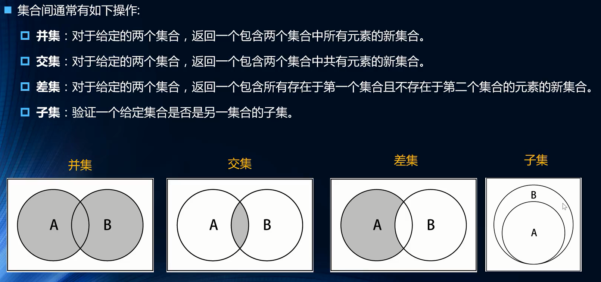    
+ 集合的实现代码
```javascript
//集合类的定义
class Set{
    //属性
    constructor(){
        this.items = {};//使用js原生Object对象实现
    }
    //操作
    //add(ele):添加元素，添加成功返回true，失败返回false
    add(ele){
        //1.判断集合中是否存在相同的元素
        if(this.has(ele)){
            return false;
        }
        //2.如果不存在再添加
        this.items[ele] = ele;
        return true;
    }
    //remove(ele):删除指定值的元素，删除成功返回true，失败返回false
    remove(ele){
        //1.判断集合中是否存在相同的元素
        if(!this.has(ele)){
            return false;
        }
        //2.如果存在再删除
        delete this.items[ele];
        return true;
    }
    //has(ele):集合中包含指定值的元素返回true，不包含返回false
    has(ele){
        return this.items.hasOwnProperty(ele);
    }
    //clear():清空集合
    clear(){
        this.items = {};
    }
    //size():返回集合的元素个数
    size(){
        return Object.keys(this.items).length;
    }
    //values():返回集合所有元素值的数组
    values(){
        return Object.keys(this.items);
    }

    //union(set):并集，返回原集合与另一个集合的并集的新集合
    union(set){
        //1.创建一个新集合
        let union = new Set();
        //2.将原集合的数据添加到新集合中
        for(let s in this.items){
            union.add(s);
        }
        //3.将另一个集合的数据添加到新集合中,由于add操作本身就有去重的的效果，所以直接添加即可
        for(let s in set.items){
            union.add(s);
        }
        //4.返回这个新集合
        return union;
    }

    //intersection(set):交集,返回两个集合的交集元素形成的新集合
    intersection(set){
        //1.创建一个新集合
        let intersection = new Set();
        //2.将原集合转成一个数组来遍历
        this.values().forEach(val => {
            //3.对于每一个原集合的元素，判断传入的集合是否包含这个元素，如果包含则添加到新集合中
            if(set.has(val)){
                intersection.add(val);
            }
        });
        //4.返回新集合
        return intersection;
    }

    //difference(set):差集,返回原集合有，传入集合没有的部分的新集合
    difference(set){
        //1.创建一个新集合
        let difference = new Set();
        //2.创建原集合的数组形式，遍历数组
        this.values().forEach(val => {
            //3.对于原集合中的每一个元素，如果传入集合不包含包含该元素则添加到新集合中
            if(!set.has(val)){
                difference.add(val);
            }
        });
        //4.返回新集合
        return difference;
    }

    //subset(set):子集,返回原集合是否是传入集合的子集，是返回true，否返回false
    subset(set){
         //1.创建一个新集合
         let subset = new Set();
         //2.创建元集合的数组形式，使用every遍历原集合，如果每一个元素都被传入集合包含，则最终结果是true
         return this.values().every(val => {
             if(set.has(val)) return true;
         });
    }
}

module.exports = Set;

```

## 字典Map
+ 认识字典：字典里面存储的是键值对，ES6里面也新加入了字典的数据类型
+ 特点
    - 一一对应的关系
    - 使用字典的方式{'name' : 'huimin' , 'age' : 18} 通过key取出value
    - 字典中的key是没有顺序且不可重复的
    - 在其他的语言中叫什么：python字典类型dict,swift字典dictionary,java映射HashMap
    - 数组、集合、字典很重要，几乎是所有编程语言都会默认提供的类型
    - 使用字典的方式: {"age" : 18, "name" : "Coderwhy", "height": 1.88}. 可以通过key取出value
    - 实现方式：js的Object对象
+ 常见操作    
    - set(key,value)：向字典中添加新元素。
    - remove(key)：通过使用键值来从字典中移除键值对应的数据值。
    - has(key)：如果某个键值存在于这个字典中，则返回true，反之则返回false。
    - get(key)：通过键值查找特定的数值并返回。
    - clear()：将这个字典中的所有元素全部删除。
    - size()：返回字典所包含元素的数量。与数组的length属性类似。
    - keys()：将字典所包含的所有键名以数组形式返回。
    - values()：将字典所包含的所有数值以数组形式返回。


## 哈希表HashTable
+ 认识哈希表：哈希表是很多编程语言直接或者间接使用过这种数据结构，哈希表是通过数组实现的，但是相较于数组又有很多优势，数组有一下特点：1.插入操作效率低2.跟据下表查询效率高，根据内容查询效率低3.删除操作效率低，哈希表的存在可以让数组的插入删除操作效率和根据下标查询一样高，不论是多大的数据量，都能瞬间执行操作，时间级别是O(1)，速度比树还要快，并且编码相对树更容易。哈希表的不足是，哈希表的数据不能无序的，key是不能重复的。
+ 特点
    - 哈希表是通过数组实现
    - 哈希表的数据不能无序的，key是不能重复的,数组都可以
    - 哈希表的结构就是数组，特别之处就是通过哈希函数将数组下标值进行变换得到HashCode
    - `名称--哈希函数-->下标值` 哈希函数干的事情是：将要存储的数据通过计算得到一个下标值，根据下标位置进行存储，以后根据数据内容查询的时候就能直接得到下标，再根据下标瞬间找到数据了。
+ 哈希化案例理解
    - 公司员工名、电话等员工信息的存储，根据员工名查询员工信息，考虑数组，链表，哈希表的方式存储查询和增删操作
    - 500000个单词的存储，数据量大的时候根据单词的英文线性查找中文解释效率是很低的，考虑哈希表的存储和查询方式， `python --哈希函数--> 1000下标` 存储在下标1000的位置，下次访问的时候就快多了
    - 以上案例都指向一个问题：**字符串转为下标值**
    - 本质是`字母/文字转数字`
    - 字母转数字的方法：
        * 26个字母，加一个空格27中字母分别对应1~27
        * 可以将单词根据字母进行拆解，比如cat就是3 1 20 17
        * 为了让不同的单词对应的数字不重复，就可以进行一个`27的幂相乘再求和`
        * cat = 17 + 20*27 + 1*27*27 + 3*27*27*27 = 60337
        * 出现了新的问题，有的单词太长了，算出来的数字太大，导致数组占得内存过大
        * 需要一种压缩方案，将巨大的幂的连乘的数字压缩到可接受的数组范围
        * 一种简单的压缩方案是：取模。例如将0~199范围内的数字压缩到0~9范围内，需要对10取模
+ 哈希化：将大数字转化成大小合适的数组的下标的过程
+ 哈希函数：将单词转成大数字，再将大数字哈喜欢成数组下标值的函数实现过程
+ 哈希表：将数据根据计算出来的下标值插入到数组中，对整个数据结构的封装，叫哈希表 
+ 将单词哈希函数转成下标后出现重复怎么办：
    - 场景——在0~199中选5个数放在长度为10的数组中，33 ，82 ，11 ，45 ，93
    - 哈希化之后得到3 2 1 5 3的下标，有两个3就冲突了
    - 解决方案：链地址法（拉链法）、开放地址法
+ 解决下标冲突——链地址法
    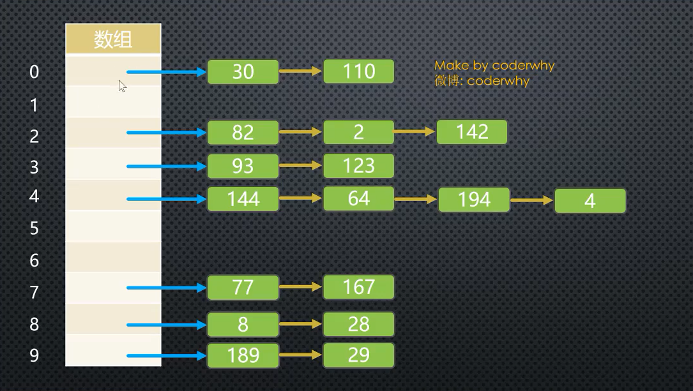
    - 本质是哈希数组里**每个单元**不在存储**单个数据**，而是**一个链条**。
    - 这个链条的数据结构是链表或者数组
    - 一旦发现数组下标计算出现重复，就将数据插入到链表的首部或者尾部
    - 查询时，先根据哈希化的下标值找到哈希数组对应的位置，再取出链表，依次线性查询数据
    - 根据业务需求，如果新存储的数据访问的可能性更高，就选择链表，并插入到链表的前端，因为插入前段查找更快，链表的前端插入操作效率比数组高
    - 由于哈希化的取余操作产生的同样余数的数字不会太多，所以把数组的每一个元素弄成一个链表/数组，链表/数组不会很长，相同下标的元素放在数组指定下标的一个链表/数组里
    - 比如图里面的数据110，首先根据110%10 = 0 决定了他存在数组下标为0的格子的链表里，然后查询的时候也做同样的计算110%10=0所以去访问数组里下标为0的位置，线性查询这个链表康康哪个是110
+ 解决下标冲突-开放地址法
        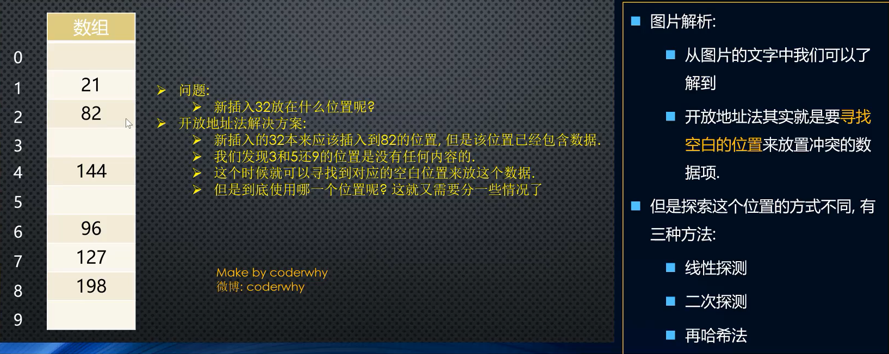
    - 本质是寻找空白的单元格来存放下标重复的数据
    - 分类
        * 线性探测
        * 二次探测
        * 再哈希法
    - 线性探测
        
        
    - 二次探测
        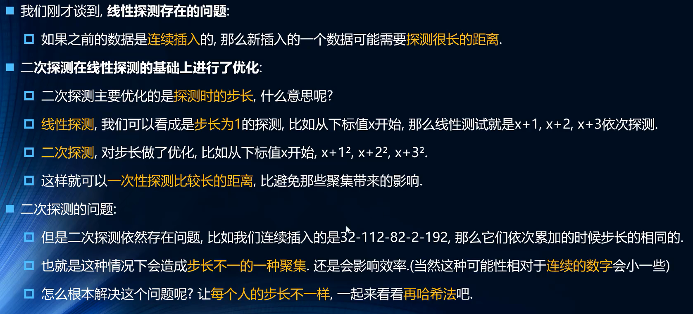
    - 再哈希法
        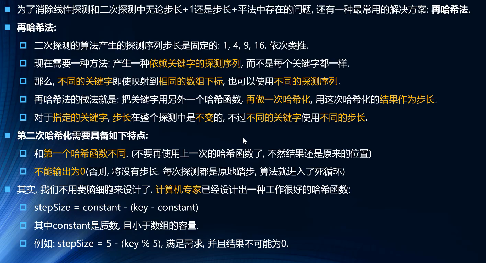
        * 本质就是做两次哈希化，第一次哈希化的结果作为下标值，第二次哈希化的结果作为探测步长
        * 要求两次的哈希函数不一样
        * 要求第二次哈希化的结果不能为0
        * 再哈希函数：`step = constant - (key % constant)`满足要求且结果不可能为0
        * 其中constant是质数，小于哈希数组容量。
+ 哈希化的效率
    - 如果没有下标冲突，效率很高
    - 如果有下标冲突，存取的时间取决于单元格链的长度/开放地址的探测长度
    - 平均探测时间取决于填装因子的大小，填充因子越大，表示包含数据项越多，拉链长度越长/表内空白格越少，探测的次数越多，探测的长度越长。
    - 填装因子 = 哈希表包含的数据项count / 哈希表的长度limit。链地址法的填装因子可以>1,开放地址法的填装因子是<=1的
    - 在真实开发中使用连地址法更多
        * 效率基本上是随着哈希表的数据变多而线性下降的，不会指数下降
        * 因为不会添加了某元素后性能急剧下降
        * java里的HashMap使用的就是链地址法
    - 开放地址法、链地址法的效率图
        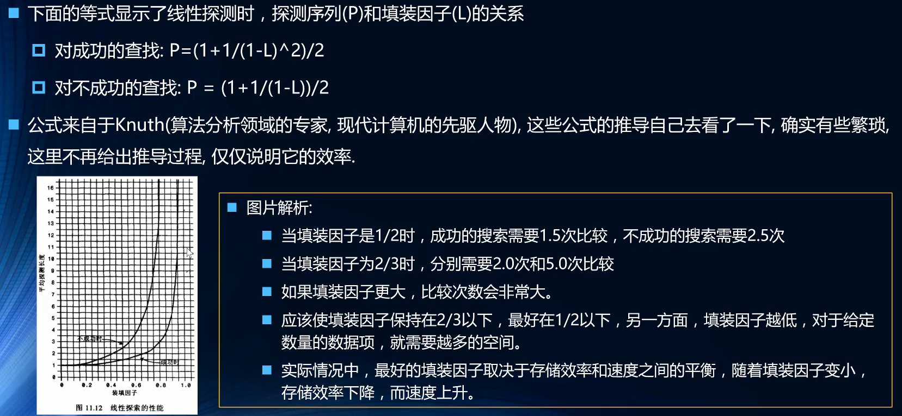
        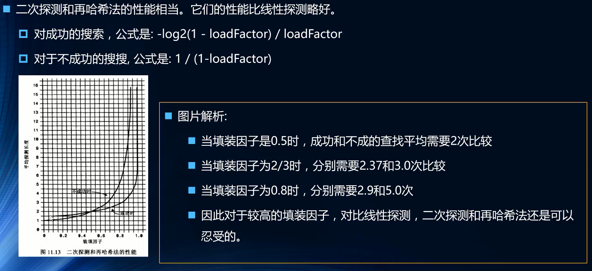
        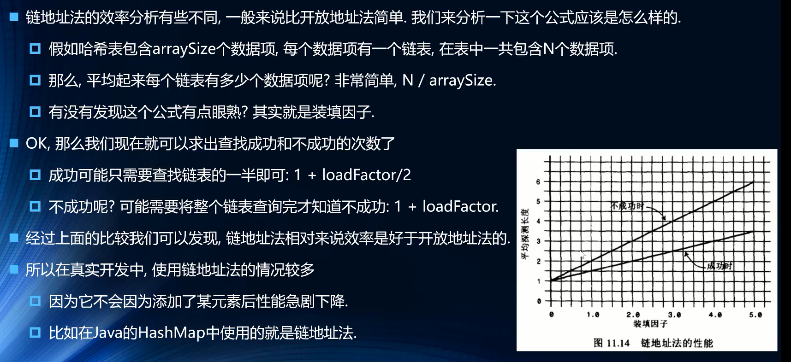
+ 什么是优秀的哈希函数
    - 快速计算 + 下标均匀分布
    - 哈希表的核心就是哈希函数，最优秀之处就是存取快速
    - 所以好的哈希函数的算法不能复杂，不然会算的慢
    - 于是要尽量少用乘法和除法，因为这两种计算性能较低 
+ 快速计算——霍纳法则
    - 在将字符转换为大数字的时候使用幂的乘法求和
    - 这种算法的计算法复杂度是比较高的，乘法N^2次，加法N次
    - 经过霍纳法则的因子提取将复杂度降低,乘法N次，加法N次，从O(n^2)降低到O(n)
    - 举个栗子：字符串对应的数字码分别为3 11 29 14，幂底数取37
    - 结果为：3×37^3 + 11×37^2 + 29×37 + 14
    - 提取因子之后得到: 37×(37×(3×37 + 11) + 29) + 14
    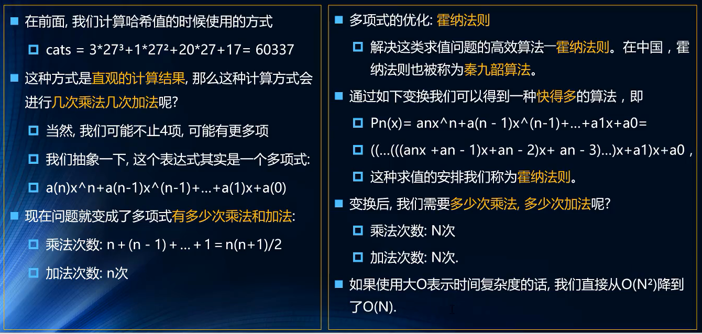
+ 均匀分布——使用质数
    - 在使用常量的地方使用我们神奇的质数,数论里面讨论的结果
    - 例如：数组的长度,解析字符成为大数字的时候幂的底数
    - 在链地址法里面无所谓了就，开放地址法得用质数
+ Java中的hashMap
    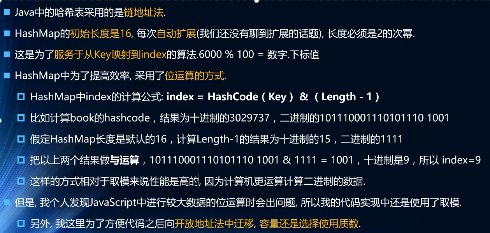
+ 哈希表的实现
    - 使用链地址法实现哈希表，链使用数组（链表也能用）实现
    - 哈希表的属性
        * storage:哈希数组
        * count：哈希表中已经存储的数据项
        * limit:哈希表数组的长度
    - 存储在哈希表中的元素都是key-value键值对的形式存在的，存的时候根据key来计算存放位置，查的时候也是。
    - 常用操作
        * put(key , value):添加/修改元素，由于哈希表的key是不允许重复的所以如果检查key发现没有就是添加，如果有就是覆盖修改
        * get(key):获取元素的值，根据key关键词获取全部信息
        * remove(key):根据关键词key来删除数据,返回被删除的数据
        * isEmpty():判断哈希表是否为空
        * size():判断哈希表中存储的元素个数
        * resize(newLimit):哈希表的扩容/缩容
+ 哈希表的扩容/缩容
    - 为什么扩容/缩容
        * 哈希表的容量设置的默认值是7(自己设定的初始值)，使用的冲突解决方法是拉链法
        * 此时填装因子会越来越大，影响效率
        * 所以要将哈希表的数组大小扩容
        * 扩容一般是扩大至两倍
        * 缩容一般是缩小到1/2
    - 怎么扩容/缩容
        * 容量扩大后，所有的元素要重新插入，否则limit变了元素key算出来的index就变了，原来的元素将找不到了。比如hashCode=12时，limit为8，index为4 limit为16，index为12
        * 当填装因子loadFactor > 0.75时就需要扩容了。即 count / limit > 0.75时扩容
        * 当填装因子loadFactor < 0.25时就需要缩容了。即 count / limit < 0.25时缩容
    - 什么时候扩容/缩容
        * 在put、remove操作的时候会改变loadFactor，所以在这种时候做扩容缩容操作
    - 怎么保证新的容量恒为质数确保下标分布均匀
        * 定义一个newPrime函数，返回最接近参数的质数作为新的容量    
+ 哈希表的封装源码
```javascript
//哈希表类的封装

class HashTable{
    //属性
    constructor(){
        this.storage = []; //哈希表内的数组
        this.count = 0; //已经存储的元素个数
        this.limit = 7; //数组的长度
    }

    //操作
    //put(key , value):添加/修改，如果检查key发现没有就是添加，如果有就是覆盖修改
    put(key , value){
        //1.通过哈希函数算出key转化后得到的下标值index
        let index = this.hashFunc(key , this.limit);
        //2.根据下标值获取storage数组对应位置的数组桶bucket,如果没有就创建一个桶
        let bucket = this.storage[index];
        if(!bucket){
            bucket = []
            this.storage[index] = bucket;
        }
        //3.遍历这个桶，查看有没有相同的key值，如果有就是修改操作,结束操作
        for(let i =0 ; i < bucket.length ; i++){
            let tuple = bucket[i]; //元素存储在tuple里 tuple[0]放key  tuple[1]放value
            if(tuple[0] == key){
                tuple[1] = value;
                return;
            }
        }
        //4.桶里没有key就是添加操作，没有key上面的循环会自己遍历完桶里最后一个
        bucket.push([key , value]);
        //5.元素个数count加一
        this.count += 1;
        //6.判断是否需要扩容
        if(this.count > this.limit * 0.75){
            let newLimit = this.newPrime(this.limit * 2);
            this.resize(newLimit);
        }
    }

    //get(key):获取元素的值，根据key关键词获取全部信息
    get(key){
        //1.根据key算出下标值index
        let index = this.hashFunc(key , this.limit);
        //2.获取下标值的数组桶bucket
        let bucket = this.storage[index];
        //3.如果桶是null直接返回null
        if(!bucket) return null;
        //4.如果桶不是null，遍历这个桶线性查找key相等的tuple的value并返回
        for(let i =0 ; i < bucket.length ; i++){
            let tuple = bucket[i]; 
            if(tuple[0] == key) return tuple[1];
        }
        //4.遍历完了桶都没找到，说明没有，返回null
        return null;
    }

    //remove(key):根据关键词key来删除数据,返回被删除的数据
    remove(key){
        //1.根据key算出下标值index
        let index = this.hashFunc(key , this.limit);
        //2.获取下标值的数组桶bucket
        let bucket = this.storage[index];
        //3.如果桶是null直接返回null
        if(!bucket) return null;
        //4.如果桶不是null，遍历这个桶线性查找key相等的tuple然后删除桶里的tuple，存储量建议，返回value
        for(let i =0 ; i < bucket.length ; i++){
            let tuple = bucket[i];
            if(tuple[0] == key){
                bucket.splice(i, 1);
                this.count -= 1;
                //5.判断是否需要缩容
                if(this.count < this.limit * 0.25){
                    let newLimit = this.newPrime(parseInt(this.limit / 2));
                    this.resize(newLimit);
                }
            }
            return tuple[1];
        }
        //6.遍历完了桶都没找到，说明没有，返回null
        return null;
    }

    //isEmpty():判断哈希表是否为空
    isEmpty(){
        return this.count == 0;
    }

    //size():判断哈希表中存储的元素个数
    size(){
        return this.count;
    }

    //resize(newLimit):哈希表的扩容/缩容
    resize(newLimit){
        //1.建立一个引用指向原来的哈希数组，做一个保存
        let tmp = this.storage;
        //2.重置哈希数组的属性为新值
        this.storage = [];
        this.count = 0;
        this.limit = newLimit;
        //3.遍历原数组，取出所有的桶，将桶里的数据put到新的哈希数组中
        tmp.forEach(bucket => {
            //3.1如果桶不是空的才去取里边的数据
            if(bucket){
                bucket.forEach(tuple => {
                    this.put(tuple[0] , tuple[1]);
                });
            }
        });
    }

    //isPrime(num):判断参数是否为一个质数
    isPrime(num){
        //1.求参数的平方根的整数
        let sqrt = parseInt(Math.sqrt(num));
        //2.遍历2~平方根查看是否存在能整除参数的因子，存在则返回false，不存在则返回true
        for(let i = 2 ; i <= sqrt ; i++){
            if(num % i == 0){
                return false;
            }
        }
        return true;
    }

    //newPrime(num):返回一个最接近参数的质数
    newPrime(num){
        while(!this.isPrime(num)){
            num += 1;
        }
        return num;
    }

    /**
     * 哈希函数
     * @param {*string} str  表示需要被存储的字符串数据
     * @param {*number} size 表示哈希表数组的大小
     */
    hashFunc(str , size){
        //1.霍纳法则，将字符串转化成大数字hashCode
        let hashCode = 0;
        //1.1遍历这个字符串，将每个字符转化成utf-8（unicode）字符集中对应的数字
        for(let c in str){
            //1.2使用霍纳法则计算幂的乘法加和 ， 选取开发中常用的指数37作为幂的底数
            hashCode = hashCode * 37 + str.charCodeAt(c); //根据字符在字符串中的下标获取Unicode编码
        }
        //2.哈希化，将大数字hashCode转化成数组下标值index
        return hashCode % size;
    }
}


module.exports = HashTable;

```

## 树Tree
+ 认识树结构：树结构是一种非线性的结构，可以表示一对多的关系，查询效率高，空间利用率高，很容易的找到最大最小的特殊值
+ 对比
    ||查询效率|增删效率|空间利用率|元素是否可重复|元素是否有序|特殊值好不好找(最大/小值)|
    |:--:|:--:|:--:|:--:|:--:|:--:|:--:|
    |数组|根据下标高，根据内容低|低|高|可|有|不好找|
    |链表|低|高|很高|可|有|不好找|
    |哈希表|超高|超高|低|不可|没有|不好找|
    |树|高||很高||有|很好找|
+ 树的术语
    - 树是n(n>=0)个节点构成的有限集合，当n=0时，称这个树为空树
    - 对于一颗非空树(n>0)，都有一个根节点root，子节点自身下面也是一颗树，成为子树subTree
    - 父节点`parent`：有子树的节点
    - 子节点`child`：和父节点互为父子节点
    - 节点的度`degree`：节点的子节点个数
    - 树的度：树中所有节点最大的度数
    - 叶子节点`leaf`：没有子节点的节点，度数为0的节点
    - 兄弟节点`sibling`：拥有同一个父节点的各个节点互为兄弟节点
    - 路径：从一个节点到另一个节点的经过的节点的序列叫路径
    - 路径的长度：路径中节点序列包含的**边的个数**叫路径长度
    - 节点的层`level`：规定根节点的层是1，节点的层等于父节点的层+1
    - 树的深度`depth`：树中最大的节点层次就是树的深度
    - 前驱：该节点左子树中键值最大的节点
    - 后继：该节点右子树中键值最小的节点

    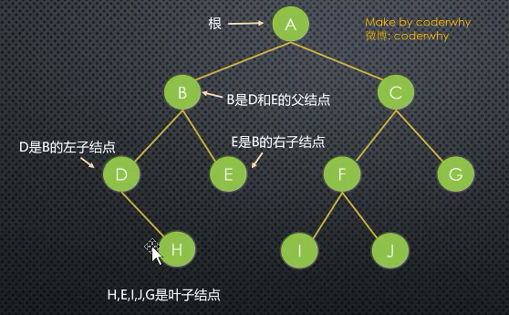        
+ 树的表示
    - 普通表示：不能确定每个节点到底有几个子节点，难以抽象出代码
        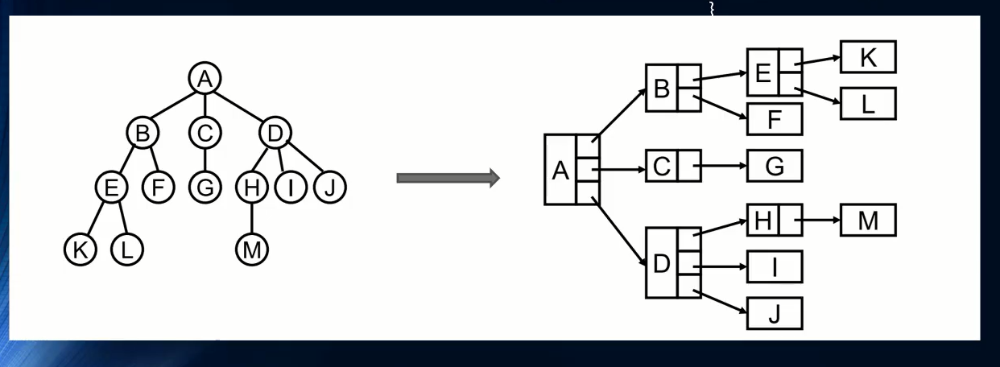        
    - 儿子兄弟表示法：左子节点指向最左的子节点，右子节点指向自己右边的第一个兄弟节点
        * 儿子兄弟表示法向右旋转45度就变成了一颗二叉树
        * 所有的树都能以儿子兄弟表示法来抽象成一个树，然后再旋转一下变成二叉树
        * 所有的树都可以以二叉树的形式来表示，研究二叉树就好了
        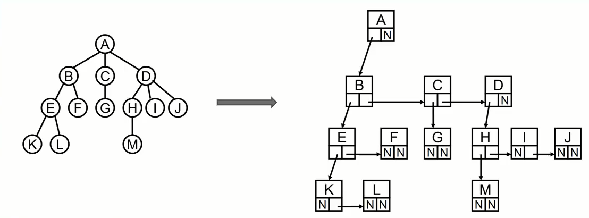        
        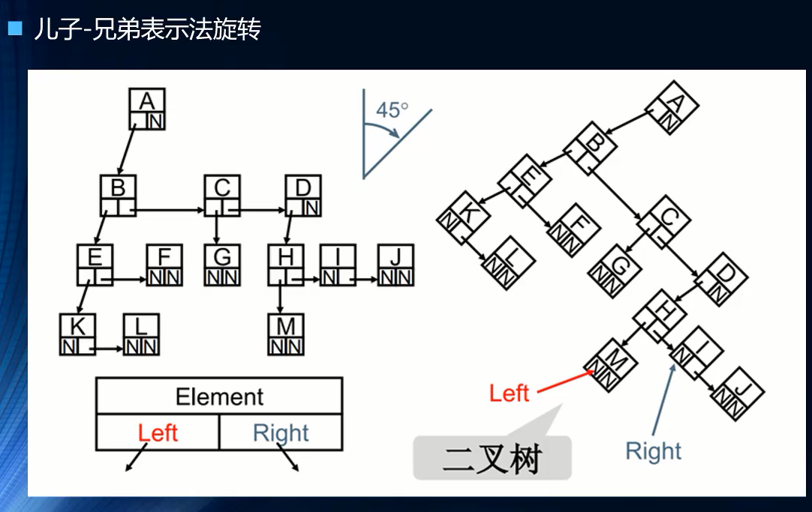        
+ 二叉树
    - 概念：树中每一个节点最多只有两个子节点的树
    - 二叉树的5种形态
    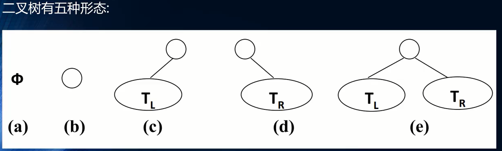
    - 二叉树特性：
        * 树的第i层，最多可以有2^(i-1)个节点,(i>=1)
        * 树的深度为k，总结点数最多可以有2^k - 1个,(k>=1)
        * n0=n2+1(n0表示度为0的节点，n2表示度为2的节点)，对于非空树，叶子结点的个数=度为2的节点个数+1
    - 特殊的二叉树（用得少
        * 完美二叉树（满二叉树）：除了叶子结点，每一层节点都由两个子节点的二叉树
        * 完全二叉树：除了最后一层，其它各层的节点都达到最多，并且最后一层的叶子结点从左向右连续存在，只缺少右侧若干节点。完美二叉树是特殊的完全二叉树
+ 二叉树的存储
    - 方式：数组或链表。但是数组存储非完全二叉树，对应位置上没有节点的话存储的是null,很浪费空间，所以还是用链表好
    - 链表存储：Node表示一个节点，包含数据，左子节点位置，右子节点位置
+ 二叉树的遍历方式
    - 前序遍历：先遍历根节点，在遍历左子树，最后遍历右子树
    - 中序遍历：先遍历左子树，在遍历根节点，最后遍历右子树
    - 后序遍历：先遍历左子树，在遍历右子树，最后遍历根节点
    - 层序遍历：按照树的每一层从上到下，从左到右遍历，使用队列可完成
+ 二叉搜索树
    - 又称为二叉排序树、二叉查找树，是开发中用的最多的树
    - Binary Search Tree - BST
    - 性质
        * 非空左子树所有的键值小于根节点键值
        * 非空右子树所有的键值大于根节点键值
        * 左右子树也是二叉搜索树
        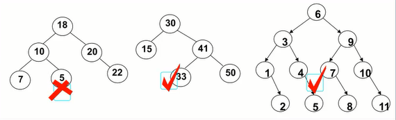
    - 特点
        * 相对较小的值总是在左节点上，相对较大的值总在右节点上
        * 一个有序数组的二分查找法底层就是二叉搜索树的内涵
    - 属性
        * 根节点root
        * 封装节点Node有key val left right    
    - 常见操作
        * insert(key ,val):向树中插入一个节点，包含键值key和内容value
        * remove(key):删除一个键值节点
        * update(key, val):修改指定键值的内容
        * search(key):查找树中的一个键值，存在则返回内容，不存在返回null
        * max():返回树中的最大键值
        * min():返回树中的最小键值
        * preOrderTraverse():前序遍历所有节点并打印
        * inOrderTraverse():中序遍历所有节点并打印
        * postOrderTraverse():后序遍历所有节点并打印
    - 删除操作
        * 度为0
        * 度为1
        * 度为2，解决方案是找到该节点的前驱或者后继来替代该节点
        * 每种情况都要考虑删除节点是根节点的情况

        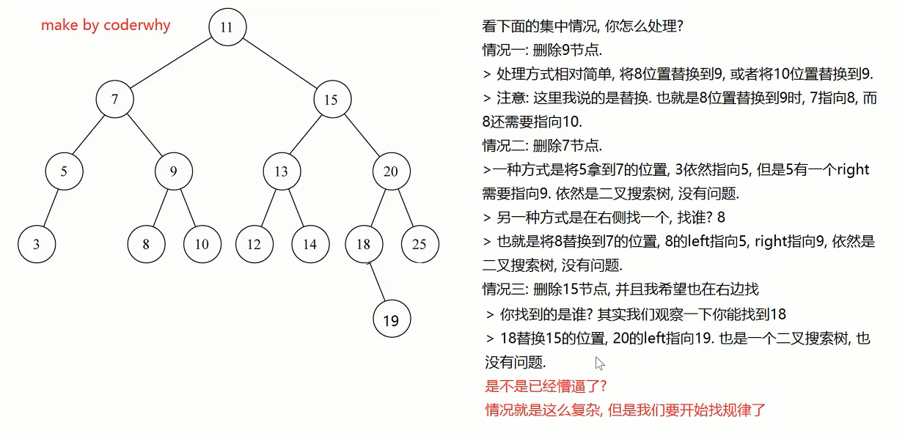
    - 缺点[平衡二叉树vs不平衡二叉树]
        * 连续插入有序的数据时，树的分布不均匀，成为非平衡树，深度层数多
        * 对于一颗分布均匀的平衡二叉树，搜索复杂度是O(logN)
        * 对于一颗分布不均匀的不平衡二叉树，搜索复杂度是O(N)，极端情况下相当于一个链表
        
        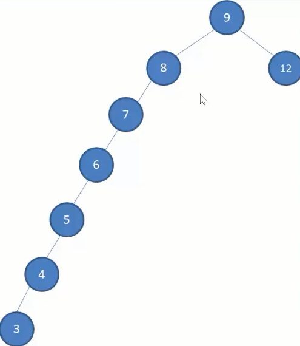
    - 保持二叉树的平衡
        * 保持树的左子孙节点数尽量等于右子孙节点数
        * 实现二叉搜索树的平衡的方法：红黑树、AVL树
        * AVL树,每个节点多保存一个数据
        * 红黑树,整体性能效率都比AVL树高，开发用的也多，推荐
+ 红黑树
    - 认识红黑树：符合二叉搜索树的基本规则，还有一些自己的特性。如果学了23树，234树就可以深度理解红黑树为啥能平衡了
    - **红黑树的规则**：
        1. 每个节点必须有颜色，红色或者黑色
        2. 根节点是黑色
        3. 所有叶子结点都是NIL节点（黑色的空节点）
        4. 所有红色节点的两个子节点都是黑色（从叶子结点到跟节点的路径上没有两个连续的红色节点）
        5. 任意节点到他自己的每一个叶子节点的路径上经过相同个数的黑色节点
    - 特性：
        * 由于红黑树的规则确保了特性：根节点到叶子结点的最长路径不超过最短路径的2倍,保证了树基本的平衡
        * 由于规则5根节点到所有叶子结点的黑色节点是一样的，然后红色节点是不连续的，所以最短路径是全都是黑色节点，最长路径是黑红相间的情况，得出了最长路径不超过最短路径的2倍的特性
        * 所以在最坏的情况下，根节点到叶子结点的最短路径是n,最长路径是2n-1,也能保证一个基本的平衡

        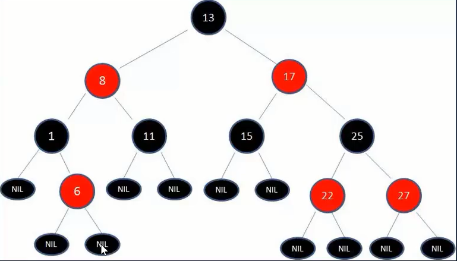
+ 红黑树保持平衡的方法
    - 变色、左旋转、右旋转
    - 变色：红色变黑色，黑色变红色
        * 新插入的节点通常都设置为红色，因为可能不影响其他节点，比如上图插入一个红色的14
    - 左旋转：逆时针旋转。父节点被自己的右孩子替代，自己作为自己的左孩子。如果右孩子有左子节点则平移到左边作为右子孩子
    - 有旋转：顺时针旋转。父节点被自己的左孩子替代，自己作为自己的右孩子。如果左孩子有右子节点则平移到右边作为左子孩子
    - 定义：新插入的节点为N，新节点的父节点为P，爷爷节点为G，叔叔节点为U
    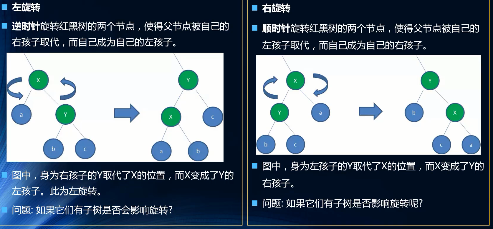
+ 红黑树插入操作的5种情况
    - 定义：新插入的节点为N，新节点的父节点为P，爷爷节点为G，叔叔节点为U
    - 查找：按照二叉搜索树的规则查找到新节点N应该插入到哪个位置，就有了PGU节点的所在
    - 情况1：树是空树，N插入作为根节点。只需将N颜色从红色变为黑色即可。
    - 情况2：P黑。不需要动别人，只需在N的下面加两个NIL节点即可。
    - 情况3：P红U红，意味着G黑。需要将P，U变黑，G变红，即将PUG都反色。
    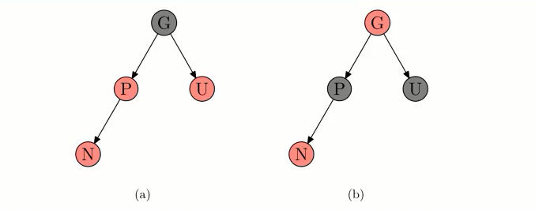
    - 情况4：P红U黑，N是左孩子，意味着G黑。需要将P变黑，G变红，以G为根右旋转。
    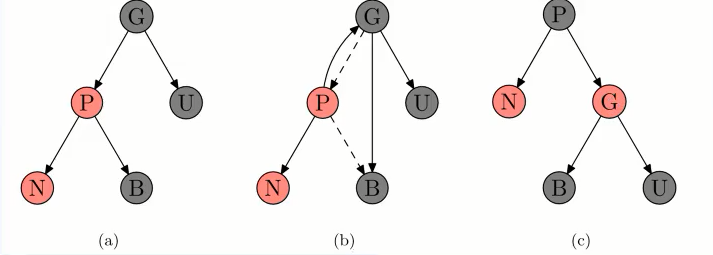
    - 情况5：P红U黑，N是右孩子，意味着G黑。以P为根左旋转，N变黑，G变红，以G为根右旋转（相当于以P为根左旋转之后，在将P作为新插入的红色节点看待，做一遍4）
    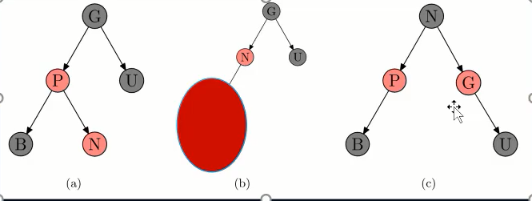
+ 红黑树案例推演
    - 案例1：依次插入10 9 8 7 6 5 4 3 2 1怎么插入
    - 遇到问题找上面5种情况的对应，变换完了之后还是不对，就把子树当做一个节点，迭代操作继续变换 
+ 代码实现
```javascript
//二叉搜索树类的封装

class BinarySearchTree{
    //属性
    constructor(key){
        this.root = null;
    }
    //操作
    // insert(key ,val):向树中插入一个节点，包含键值key和内容value
    insert(key ,val){
        //1.创建新节点
        let newNode = new Node(key , val);
        //2.判断根节点有没有值，如果没有，新节点作为根节点
        if(!this.root){
            this.root = newNode;
        }else{
            insertNode(this.root , newNode);
        }
        //3.如果有值，则比较当前节点和新节点key的大小
        //4.如果新节点比当前节点小
        //4.1 查看当前节点的左孩子，如果左孩子没得，将新节点插入作为当前节点的左孩子
        //4.2 如果有左孩子，将左孩子作为新的当前节点，和新节点作比较，看看谁大，
        //这时就进入了循环递归，调用递归函数，传入新的值即可，递归开始之处是3.
        //5.如果新节点比当前节点大
        //5.1 查看当前节点的右孩子，如果右孩子没得，将新节点插入作为当前节点的右孩子
        //4.2 如果有右孩子，将右孩子作为新的当前节点，和新节点作比较，看看谁大，
        //这时就进入了循环递归，调用递归函数传入新的值
        //6.于是可将3~5步骤封装为一个函数共2步骤调用,函数的参数分别是当前节点和新节点
        function insertNode(node , newNode){
            if(newNode.key < node.key){
                if(!node.left){
                    node.left = newNode;
                }else{
                    insertNode(node.left , newNode);
                }
            }else{
                if(!node.right){
                    node.right = newNode;
                }else{
                    insertNode(node.right , newNode);
                }
            }
        }
    }
    // remove(key):删除一个键值节点
    remove(key){
        //1.先查找到这个节点,保存他的父节点，保存他是否为左节点的一个小flag
        //1.1将当前节点设置为根节点
        let node = this.root;
        let parent = null;
        let isLeftChild = true;
        while(node){
            //1.2如果key大于当前节点则将当前节点的右节点赋值给当前节点
            if(key > node.key){
                parent = node;
                node = node.right;
                isLeftChild = false;
            }
            //1.3如果key小于当前节点则将当前节点的左节点赋值给当前节点
            else if(key < node.key){
                parent = node;
                node = node.left;
                isLeftChild = true;
            }
            //1.4如果key等于当前节点，就结束循环
            else{
                break;
            }
        }
        //1.5各种找都没找到节点，就说明没有这个节点
        if(!node){
            return; 
        }
        //2.在判断这个节点什么性质，度为0，将父节点的left/right直接指向null即可
        else if(!node.left && !node.right){
            //2.1这个度为0的节点是根节点
            if(node == this.root){
                this.root = null;
            }
            //2.2这个节点是其父节点的左节点
            else if(isLeftChild){
                parent.left = null;
            }
            //2.3这个节点是其父节点的右节点
            else{
                parent.right = null;
            }
        }
        //3.度为1
        else if(!node.left){//有右子节点
            //3.1这个度为1的节点是根节点，将右子节点设为新的根节点
            if(node == this.root){
                this.root = node.right;
            }
            //3.2不是根节点，将右子节点赋值给父节点
            else if(isLeftChild){
                parent.left = node.right;
            }else{
                parent.right = node.right;
            }
        }else if(!node.right){//有左子节点
            //3.3这个度为1的节点是根节点，将左子节点设为新的根节点
            if(node == this.root){
                this.root = node.left;
            }
            //3.4不是根节点，将左子节点赋值给父节点
            else if(isLeftChild){
                parent.left = node.left;
            }else{
                parent.right = node.left;
            }
        }
        //4.度为2
        else{
            //4.1查找到当前节点的后继节点
            let successor = getSuccessor(node);
            //4.2判断当前节点是不是根节点，如果是将后继节点赋值给根节点
            if(node == this.root){
                this.root = successor;
            }
            //4.3当前节点是父节点的左节点
            else if(isLeftChild){
                parent.left = successor;
            }
            //4.4当前节点是父节点的右节点
            else{
                parent.right = successor;
            }
            //4.5将当前节点的左子树赋值给新节点的left
            successor.left = node.left;
        }

        //获取后继节点，并处理后继节点不是删除节点的右节点的情况
        function getSuccessor(node){
            //1.定义后继节点，遍历时的当前节点，后继节点的父节点
            let successor = node;
            let successorParent = node;
            let curNode = node.right;
            //2.遍历右子树，找到后继节点
            while(curNode){
                successorParent = successor;
                successor = curNode;
                curNode = curNode.left;
            }
            //3.如果后继节点是被删节点的右节点还好说，如果不是，
            if(successor != node.right){
                //3.1后继节点的右节点赋值给后继节点的父节点的左节点，
                successorParent.left = successor.right;
                //3.2被删节点的right赋值给后继节点的right
                successor.right = node.right;
            }
            return successor;
        } 
    }
    // update(key, val):修改指定键值的内容
    update(key, val){
        //1.获取根节点作为当前节点
        let node = this.root
        //2.循环遍历节点，直到当前节点为空，判断当前节点和key谁大，
        while(node){
            //2.1如果key大于当前节点则将当前节点的右节点赋值给当前节点
            if(key > node.key){
                node = node.right;
            }
            //2.2如果key小于当前节点则将当前节点的左节点赋值给当前节点
            else if(key < node.key){
                node = node.left;
            }
            //2.3如果key等于当前节点，就返回节点的val
            else{
                node.val = val;
                return;
            }
 
        }
        return;
    }
    // search(key):查找树中的一个键值，存在则返回内容，不存在返回null
    search(key){//尝试使用循环的方式解决问题，代替递归
        //1.获取根节点作为当前节点
        let node = this.root
        //2.循环遍历节点，直到当前节点为空，判断当前节点和key谁大，
        while(node){
            //2.1如果key大于当前节点则将当前节点的右节点赋值给当前节点
            if(key > node.key){
                node = node.right;
            }
            //2.2如果key小于当前节点则将当前节点的左节点赋值给当前节点
            else if(key < node.key){
                node = node.left;
            }
            //2.3如果key等于当前节点，就返回节点的val
            else{
                return node.val;
            }
        }
        //3.没找到返回null
        return null;
    }
    // max():返回树中的最大键值
    max(){
        //1.先找到根节点
        let r = this.root;
        //2.循环遍历根节点的右节点，找到最后一个右节点
        if(r){
            while(r.right){
                r = r.right;
            }
            //3.返回最后一个右节点的key值
            return r.key;
        }
        return null;
    }
    // min():返回树中的最小键值
    min(){
        //1.先找到根节点
        let r = this.root;
        //2.循环遍历根节点的左节点，找到最后一个左节点
        if(r){
            while(r.left){
                r = r.left;
            }
            //3.返回最后一个左节点的key值
            return r.key;
        }
        return null;
    }
    // preOrderTraverse():前序遍历所有节点并打印
    preOrderTraverse(){
        //1.调用封装函数
        preOrderTraverseNode(this.root);
        //2.封装遍历并打印的函数，node为当前节点
        function preOrderTraverseNode(node) {
            //1.如果该节点为空，就啥也不干，如果节点不为空打印该节点
            if(node){
                console.info(node.key + ' ');
                //2.查看该节点的左节点，如果不为空则递归调用本函数
                if(node.left){
                    preOrderTraverseNode(node.left);
                }
                //3.看看该节点的右节点，如果不为空则递归调用本函数
                if(node.right){
                    preOrderTraverseNode(node.right);
                }
            }
        }
    }
    // inOrderTraverse():中序遍历所有节点并打印
    inOrderTraverse(){
        //1.调用封装函数
        inOrderTraverseNode(this.root);
        //2.封装遍历并打印的函数，node为当前节点
        function inOrderTraverseNode(node) {
            //1.如果该节点为空，就啥也不干，
            if(node){
                //2.查看该节点的左节点，如果不为空则递归调用本函数
                if(node.left){
                    inOrderTraverseNode(node.left);
                }
                //3.如果节点不为空打印该节点
                console.info(node.key + ' ');
                //4.看看该节点的右节点，如果不为空则递归调用本函数
                if(node.right){
                    inOrderTraverseNode(node.right);
                }
            }
        }
    }
    // postOrderTraverse():后序遍历所有节点并打印
    postOrderTraverse(){
        //1.调用封装函数
        postOrderTraverseNode(this.root);
        //2.封装遍历并打印的函数，node为当前节点
        function postOrderTraverseNode(node) {
            //1.如果该节点为空，就啥也不干，
            if(node){
                //2.查看该节点的左节点，如果不为空则递归调用本函数
                if(node.left){
                    postOrderTraverseNode(node.left);
                }
                //3.看看该节点的右节点，如果不为空则递归调用本函数
                if(node.right){
                    postOrderTraverseNode(node.right);
                }
                //4.如果节点不为空打印该节点
                console.info(node.key + ' ');
            }
        }
    }
}

class Node{
    constructor(key, val){
        this.key = key;
        this.val = val;
        this.left = null;
        this.right = null;
    }
}

module.exports = BinarySearchTree;
```


## 图Graph
+ 认识图结构：图是非常常见的结构。图论是数学的一个分支，树是图的一种特殊情况。研究图就是在研究事物之间的关系，**顶点**代表事物，**边**代表二者之间的关系。图结构常用来模拟人与人之间的关系网、北京地铁站、村庄关系网，像这种关系网不论用几叉树都是表示不出来的。
+ 特点：
    * 包含一组顶点，使用**V(vertex)**表示顶点的集合
    * 包含一组边，使用**E(edge)**表示边的集合
        - 边是顶点之间的连线
        - 边可以是有方向的也可以是无方向的
        - A---B无向，A-->B有向
+ 图的术语
    - 顶点：图中的节点
    - 边：顶点之间的连线
    - 相邻顶点：由一条边链接到的两个顶点
    - 度：一个顶点的度是它相邻顶点的数量
    - 路径：一个顶点到另一个顶点经过的顶点的序列
    - 简单路径：不包含重复的顶点的路径。例如0 1 5 9
    - 回路：第一个顶点和最后一个顶点相同的路径是回路。例如0 1 5 6 3 0
    - 无向图：所有的边都没有方向的图
    - 有向图：图中的边是有方向的。例如如果有一个边是1-->0 √  1<--0 ×
    - 无权图：边不带权重的图
    - 有权图：边携带权重的图，权重可以自己定义含义，比如距离、时间、票价
    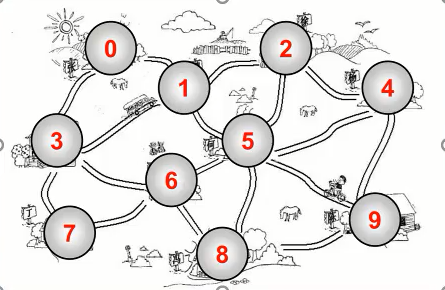
+ 图的表示
    - 邻接矩阵
        * 使用二维数组来表示顶点之间的连接
        * 在二维矩阵中，0表示无连线，1表示有连线
        * 邻接矩阵是关于对角线对称的
        * 严重问题：对于一个边很少的稀疏图，矩阵需要耗费大量空间存储0来表示不存在的边
        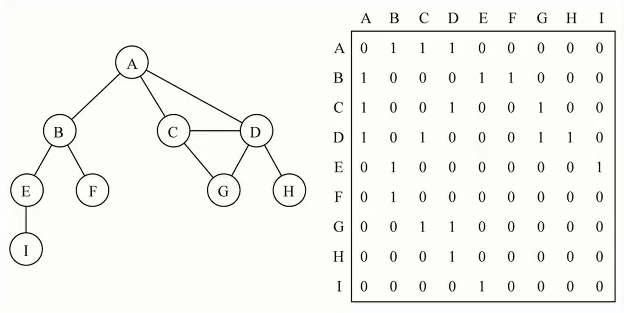
    - 邻接表
        * 邻接表由每个顶点和顶点相邻的顶点列表组成
        * 方便计算出度，即一个顶点指向外边的相邻顶点个数
        * 在实现图的时候，边就可以使用邻接表的思想来实现，字典的key存顶点，value存顶点的相邻顶点
        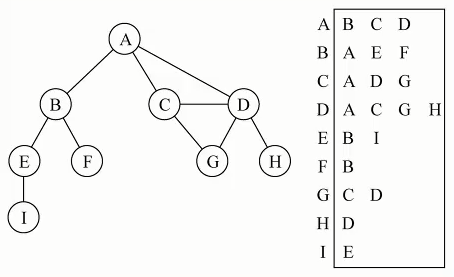
        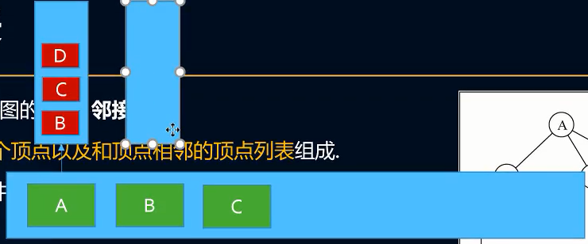
+ 图的实现
    - 属性：顶点的数组，边的字典（使用邻接表的思想）
    - 常见操作：
        * addVertex(v)：添加顶点
        * addEdge(v1, v2)：添加边
        * toString()：使用邻接表的表达方式打印图的结构
        * bfs(fisrstv)：广度优先遍历。使用队列实现
        * dfs(fisrstv)：深度优先遍历。使用栈或者递归函数实现
+ 图的遍历
    - 访问图的每一个顶点，要求不重复访问同一个顶点
    - **广度优先搜索BFS**，breadth-first search 
    - **深度优先搜索DFS**，depth-first search 
    - 两种搜索方式都需要指定第一个被访问的顶点
    - 顶点的状态：
        * 白色：顶点没被访问过
        * 灰色：顶点被访问过，但是没有被探索过或没有被完全探索过。探索指的是访问顶点的邻接节点。
        * 黑色：顶点被访问过且被完全探索过。
+ 代码实现
```javascript
//图类的封装（无向图）
let Dictionary = require('../7.字典/01_字典类的封装');
let Queue = require('../2.队列/01_队列的封装');
class Graph{
    //属性
    constructor(){
        this.vertexes = []; //数组放顶点
        this.edges = new Dictionary(); //字典放边
    }

    //操作
    // addVertex(v)：添加顶点
    addVertex(v){
        //1.添加顶点
        this.vertexes.push(v);
        //2.给顶点创建自己对应边的数组,就是在字典里面建一个k-v对，v相邻顶点的列表创建一个空数组
        this.edges.set(v, []);
    }

    // addEdge(v1, v2)：添加边
    addEdge(v1, v2){
        //1.在字典里面找到key为v1的顶点，给她的数组push进去一个v2
        this.edges.get(v1).push(v2);
        //2.由于是无向图，所以还要反过来对v2操作一遍
        this.edges.get(v2).push(v1);
    }

    // toString()：使用邻接表的表达方式打印图的结构
    toString(){
        //1.遍历顶点数组，对于每一个顶点，去edges字典里面去找到他的边，然后打印出来
        let result = '';
        this.vertexes.forEach(v => {
            result += (v + ' -> ');
            this.edges.get(v).forEach(s => {
                result += (s + ' ');
            });
            result += '\n';
        });
        return result;
    }

    // bfs()：广度优先遍历
    bfs(fisrstv){
        //1.创建队列,将第一个节点入队，并且初始化所有顶点的颜色,并且把颜色变为灰色
        let q = new Queue();
        q.enqueue(fisrstv);
        let colors = this.initColor();
        colors[q] = 'grey';
        //2.当队列不为空的时候执行循环
        while(!q.isEmpty()){
            //2.1.将队列的队首元素出队
            let o = q.dequeue();
            //2.2.查找该节点的所有相邻节点，如果颜色为白色则入队，并且把颜色变为灰色，表示访问过了，下次不要在压进队列里面了
            this.edges.get(o).forEach(s => {
                if(colors[s] == 'white'){
                    colors[s] = 'grey';
                    q.enqueue(s);
                }
            });
            //2.2.打印队首节点，并标记为黑色，表示探测完毕
            console.info(o);
            colors[o] = 'black';
        }
    }

    // dfs()：深度优先遍历,使用递归函数实现，用栈太难了搞哭了，不搞了
    dfs(fisrstv){
        //1.创建一个访问顶点的函数
        let dfsvisit = (v, colors) => {
            //1.1.颜色变成灰色并打印
            colors[v] = 'grey';
            console.info(v);
            //1.2.找到相邻顶点list，遍历这个list，访问每个顶点，如果颜色是白色则访问这个顶点
            let list = this.edges.get(v);
            list.forEach(s => {
                if(colors[s] == 'white'){
                    dfsvisit(s, colors);
                }
            });
        }
        //2.初始化颜色，并调用函数
        let colors = this.initColor();
        dfsvisit(fisrstv, colors);
    }

    //初始化顶点的颜色为白色，其中数组color的下标和顶点一一对应
    initColor(){
        let colors = [];
        this.vertexes.forEach(v => {
            colors[v] = 'white';
        });
        return colors;
    }
}

module.exports = Graph;

```


## 了解排序算法
+ 大O表示法：一种粗略的度量方式来表示操作的事件复杂度，反应出算法的效率
    - 在数据量不同的情况下，不同的算法效率是会随着改变的，所以把效率表示成一个关于数据量的函数表达式比较合理
    - 类型（效率逐渐下降）：
        * O(1)：常数的
        * O(log(n))：对数的
        * O(n)：线性的
        * O(nlog(n))：线性和对数成积的
        * O(n^2)：平方的
        * O(2^n)：指数的
    - 几乎没有算法是使用2^n时间复杂度的，计算机受不了，所以必须优化
    - 推导方式：只保留最高阶项，去掉系数    
    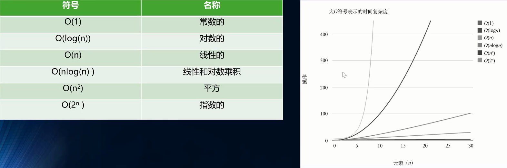    
+ 排序算法分类
    - 一共有：冒泡排序、选择排序、插入排序、归并排序、计数排序、基数排序、希尔排序、快速排序、堆排序、桶排序
    - 简单排序（时间复杂度O(n^2)）
        * 冒泡排序
        * 选择排序
        * 插入排序
    - 高级排序：
        * 希尔排序
        * 快速排序
    - 在大多数情况下快速排序的效率是最高的
+ 排序算法
    - bubbleSort: 冒泡排序
    - selectionSort: 选择排序
    - insertionSort: 插入排序
    - shellSort: 希尔排序
    - quickSort: 快速排序
+ 为了实现起来方便，封装一个ArrayList类，把排序算法封装到这个类里面作为一个方法，用起来也方便

## 冒泡排序bubbleSort
+ 认识：冒泡排序概念简单，算法效率低
+ 冒泡排序思想：
    - 列表相邻的元素两两比较，较大的那个放在右边。
    - 第一趟结束以后就是整个列表最后一个元素是最大的，第二趟就排倒数第二个元素到第一个元素，结果是第二大的元素排在倒数第二个位置。
    - 依次循环下去做多趟外层循环，直到列表没排序的元素只剩一个了。
+ 实现方式为：
    - 外层循环为定义每趟循环比较到的最大下标，第一次为length-1 ,第二次为length-1,。。。最后一次为1。
    - 实现内层循环，一趟线性相邻比较，相邻的两个元素比较大小，将大的那个放在相对的右边
+ 冒泡排序的效率
    - 比较次数：是1+2+...+n-1 = n(n-1)/2次,时间复杂度是O(n^2)
    - 交换次数：每比较一次都可能交换，50%的几率左边的比右边的大,所以平均是n(n-1)/4,时间复杂度是O(n^2)
+ 冒泡排序的示意图
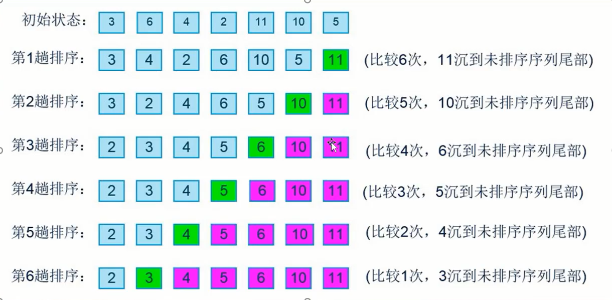
+ 代码实现
```javascript
//排序算法的实现
class ArrayList{
    //1.属性
    constructor(){
        this.items = [];
    }
    //2.操作
    //push 添加
    push(val){
        this.items.push(val);
        return this;
    }
    //toString 转成字符转返回
    toString(){
        return this.items.join(' ');
    }
    //bubblesort:冒泡排序
    bubblesort(){
        let arr = this.items;
        //1.实现外层循环:遍历x次，i定义的是每次内部比较一趟比较到的最大下标。i=length-1 i--
        let i = arr.length - 1;
        while(i > 0){
            //2.实现内层循环：将最大的一个元素放到最后,内循环遍历的元素最大的下标是i
            //2.1比较相邻的两个元素的大小，大的那个放在右边
            for(let j = 0 ; j <= i ; j++){
                if(arr[j] > arr[j+1]){
                    //swap交换两个数据,参数是数组的两个下标
                    this.swap(j, j+1);
                }
            }
            i--;
        }
    }    
    //swap交换两个数据，参数是数组的两个下标，直接传值的话是传的数值的拷贝而不是对象的引用，改变不了数组元素的值
    swap(i, j){
        let arr = this.items;
        let tmp = arr[i];
        arr[i] = arr[j];
        arr[j] = tmp;
    }
}

```


## 选择排序selectionSort
+ 认识：选择排序是冒泡排序的改良版本，将时间复杂度从O(n^2)简化到了O(n)
+ 选择排序的思想：
    - 遍历一趟数组，选择到最小的元素的下标，将最小元素和第一个元素(下标为0的元素)交换位置
    - 第二趟遍历从下标为1的元素开始到最后，选择出最小的元素的下标，将最小元素和下标为1的元素交换位置
    - 一直做上面的循环，直到没排序的元素只剩一个了
    - 外层循环用来定义每次遍历的下标从哪儿开始
    - 内层循环用来做实实在在的一趟比较，挑选最小值，和首位元素交换
    - 有个小技巧，如果一口气想不清楚实现细节的话，就先写最初场景的代码，把变量写成具体常量。第一趟跑通了之后，在把变量改成正确的数据
+ 选择排序的效率
    - 比较次数：是1+2+...+n-1 = n(n-1)/2次,时间复杂度是O(n^2)
    - 交换次数：是n-1次，,时间复杂度是O(n)比冒泡排序的交换次数要效率高
+ 示意图
    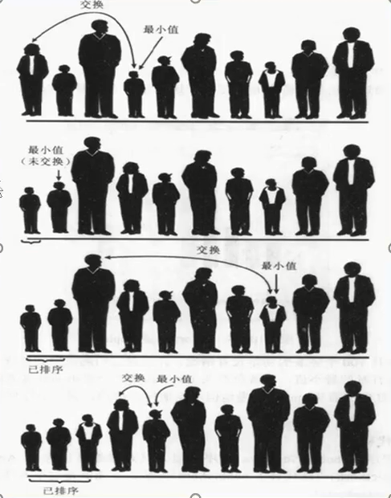
+ 代码实现
```javascript
    //selectionSort 选择排序
    selectionSort(){
        //1.外层循环用来定义遍历从哪个下标开始
        let arr = this.items;
        let i = 0;
        while(i < arr.length - 1){
            //2.内层循环做本趟遍历，选择出最小值，和首个未排序元素交换
            let minindex = i ; //2.1默认最小值的下标为首个未排序元素i
            for(let j = i ; j < arr.length ; j++){
                if(arr[j] < arr[minindex]){
                    minindex = j;
                }
            }
            //2.2将本趟的最小值和首元素交换
            this.swap(minindex , i);
            //1.1 i递增
            i++;
        }
    }
```


## 插入排序insertionSort
+ 认识：插入排序是简单排序3种方法中效率最高的一种，比冒泡排序，选择排序都优秀一点。也是学习高级排序（希尔排序，快速排序）的基础
+ 核心思想：局部有序
+ 实现思路：
    - 局部有序的列表是从小到大排列的
    - 只需捕获到局部有序列表右边的第一个无序元素
    - 把这个元素和局部有序列表逐个比对，插入到左边比他小，右边比他大的位置上，形成新的局部有序列表即可
    - 外部循环：决定局部有序列表右边的第一个无序元素的下标
    - 内部循环：无序元素和局部有序列表逐个比对，插入到左边比他小，右边比他大的位置上
    - 无序元素和局部有序列表对比的时候，插入操作可以这么实现：
        * 由于局部有序列表是从小到大排列的，无序元素i先拿出来保存一份,i先和局部元素的最右边的值比较，如果这个值比i大，就把这个值赋给i位置，继续比较局部列表的左边一个元素，如果还是大于i值，就在往右赋值，直到局部列表的某一个值小于i值，停下循环。
        * 将i值赋值给这个对的位置
+ 效率
    平均比较次数：(1+2+...n-1)/2 = n(n-1)/4
    平均赋值次数：(1+2+...n-1)/2 = n(n-1)/4
    相加得到的次数： n(n-1)/2  比冒泡和选择排序执行次数都少
    时间复杂度：O(n^2)
+ 示意图：
    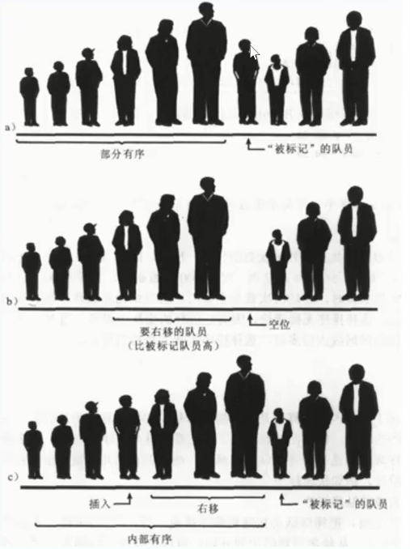
+ 实现代码
```javascript
    //insertionSort 插入排序
    insertionSort(){
        let arr = this.items;
        //1.外层循环确定局部有序列表右边第一个无序元素的下标,默认第一个局部有序列表就是第一个元素，所以无序元素下标是1
        for(let i = 1 ; i < arr.length ; i++){
            //2.内层循环，比较无序元素和局部列表的大小并插入到正确的位置
            //2.1保存一下无序元素的值
            let tmp = arr[i];
            //2.2循环比较局部列表和无需元素的大小
            let localindex = i-1;
            while(arr[localindex] > tmp && localindex >0){
                arr[i] = arr[localindex]; //向右挪一位置，不用担心i值没有，已经有tmp备份了
                localindex -= 1;
            }
            arr[localindex + 1] = tmp; //插入对的位置
        }
    }
```

## 希尔排序shellSort
+ 认识：希尔排序是插入排序的一个改进版，效率比插入排序更高.是第一个时间复杂度低于O(n^2)的伟大算法。
+ 希尔排序的实现思路
    - 先整理好分组的间隔数，gap = Math.floor(N/2)做为间隔序列
    - 比如gap=5，数组就每隔5个下标分为一组，进行内部插入排序
    - gap迭代为更小的序列3
    - 数组在根据新的间隔3的分为一组，进行内部插入排序
    - 在写代码的时候最好把插入排序的代码copy过来，然后按照示意图的例子来边改边验证
    - 插入排序就是分组间隔为1的希尔排序
+ 希尔排序的分组间隔
    - 希尔排序原稿的序列`N/2` 数组个数除以2 ，也就是说长度100的数组，分组间隔分别为50 25 12 6 3 1
    - Hibbard序列 `2^k - 1` ,奇数序列，1 3 5 7 9...
    - sedgewick序列，`4^i - 3*2^i + 1`, 就是1 5 19 41...    
+ 希尔排序的效率
    - 效率在最坏的情况下是O(n^2)，大多数情况下都好于O(n^2)
    - 希尔排序的效率是很难证明的，跟分组间隔取得数字序列有关，可以根据执行时间来统计，但是大多数情况下都由于简单排序
+ 示意图
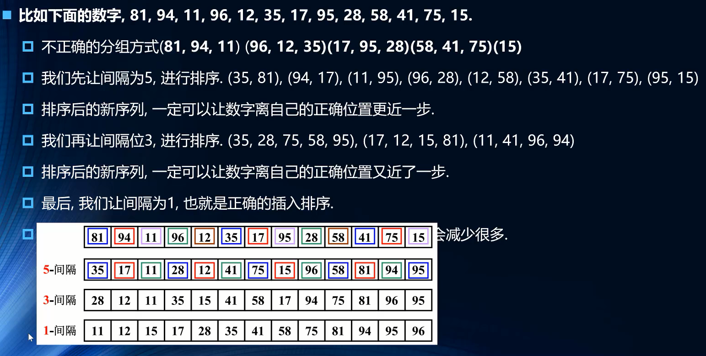
+ 实现代码
```javascript
//希尔排序
    shellSort(){
        //1.建立数组的新指针
        let arr = this.items;
        //2.设置初始的间隔值gap
        let gap = Math.floor(arr.length / 2);
        //3.外循环不断的减小gap值，间隔分组的值，直到gap变成1
        while(gap >= 1){
            //4.对于分好组的数据进行插入排序的操作
            //4.1.外层循环确定局部有序列表右边第一个无序元素的下标,所以无序元素下标是gap
            for(let i = gap ; i < arr.length ; i += gap){
                //4.2内层循环，比较无序元素和局部列表的大小并插入到正确的位置
                //4.3保存一下无序元素的值
                let tmp = arr[i];
                //4.4循环比较局部列表和无序元素的大小
                let localindex = i - gap;
                while(arr[localindex] > tmp && localindex >0){
                    arr[i] = arr[localindex]; //向右挪一位置，不用担心i值没有，已经有tmp备份了
                    localindex -= gap;
                }
                arr[localindex + gap] = tmp; //插入对的位置
            }
            //5.gap按序列变小
            gap = Math.floor(gap / 2);
        }
    }
```

## 快速排序quickSort
+ 认识：二十世纪十大算法之一，快速排序非常重要。快速排序是冒泡排序的升级版，可以在一次递归函数调用中找到某个元素的正确位置，且不需要再移动
+ 核心思想：分而治之
+ 实现思路：找到一个元素作为核心枢纽，遍历一遍元素，比枢纽小的元素放在枢纽左边，比枢纽大的挡在枢纽右边。这样一来枢纽的位置就可以敲定了，然后在来管枢纽左边的数据们，在左数组里面找到新的枢纽然后继续左右分治，直到没有能分的数据为止。
+ 代码实现思路：
    - 先找到枢纽：一般取头尾中三个数字的中位数作为枢纽。把枢纽放在数组的倒数第二个位置，三人中最大的数字放在末尾
    - 定义一个left指针指向第一个元素，一个right指针指向枢纽前一个元素
    - 如果left指针的元素比枢纽小就往右移，如果比枢纽大就停下来，去摆弄right指针
    - right指针的数据比枢纽大就往左移，小的话就停下来
    - 还有一个要求，当left right指针重合的时候，将枢纽和重合元素交换位置，完成一次枢纽的左右分治。
    - 然后选择下一个枢纽，调用递归函数
+ 枢纽的选择   
    - 枢纽又叫pivot
    - 一种优秀的选择方案：选取数组头、中、尾的中位数作为枢纽
    - 例如： 23 4 13 10 76 7 12 100 72 
    - 头中尾分别是 23 76 72
    - 中位数是72，选择72作为枢纽
    - 获取中间数字下标的方法是left + right / 2然后向下取整
+ 快速排序的效率
    - 事假你复杂度是O(n*log(n))
+ 示意图
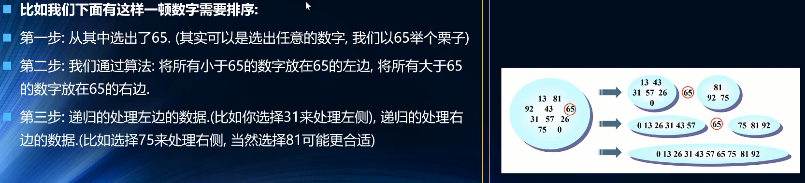


## 位运算
### 异或运算符
+ 特点：
    - 相同的数异或为0: n ^ n => 0
    - 不同的数异或为1: m ^ n => 1
    - 交换律：a ^ b ^ c <=> a ^ c ^ b
    - 结合律：a ^ b ^ c <=> (a ^ b) ^ c
    - 任何数于0异或为任何数 0 ^ n => n
+ 案例 136

## 常用算法思路
### 投票算法
+ 投票算法的原理是通过不断消除不同元素直到没有不同元素，剩下的元素就是我们要找的元素。
+ 案例 169


## JavaScript小技巧
+ 定义对象的方法
方式一：
`this.方法名 = function(){}`
方式二：
`类名.prototype.方法名 = function(){}`
区别在于方式一是给每一个对象添加方法，被创建的每一个对象都保留自己的一份，浪费空间，二方式二是给类创建一个方法，所有对象共同使用同一份方法，节省空间
+ 对象的方法如果想调用对象的属性或方法，得用this.来调用
+ 在封装类的时候善用类的继承，可以减少开发量
+ 如果在一个js文件里面一个类的定义要依赖另一个类，可以直接只向外暴露这一个类，外部调用暴露类的时候可以成功
+ 容器类的结构的常见操作是增删改查
+ sort会改变原始数组
+ 一定要注意array.forEach里面是不能return的典型错误
    ```javascript
        bucket.forEach(ele => {
            let tuple = ele;
            if(tuple[0] == key) return tuple[1];
        });
    ```
+ 所有的递归都能转换成循环的方式完成，递归代码简单但是空间占用较大，循环空间占用不大但是代码较复杂


## 数据结构的选择
+ 栈：在发现一列数据中，一个数据的加入会影响前一个或者后一个数据，可以考虑栈